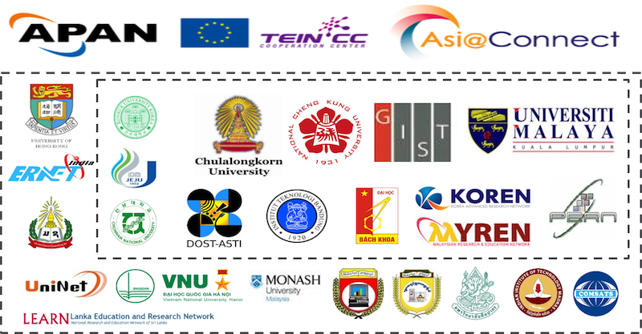

# OF@TEIN+ Participating Members

## Ambassadors

No | Name   | Institution    | Country   | Contact (Email)
---|------------|-----------------|--------------|----------------
 1 | Prof. Teck Chaw Ling   | University of Malaya (UM) | Malaysia | tchaw@um.my.edu
 2 | Prof. JongWon Kim      | Gwangju Institute of Science and Technology (GIST) | Korea | jongwon@nm.gist.ac.kr
 3 | Prof. Sunyoung Han     | Konkuk University | Korea | syhan@konkuk.ac.kr
 4 | Prof. Chaodit Aswakul  | Chulalongkorn University | Thailand | chaodit.a@chula.ac.th
 5 | Prof. Chu-Sing Yang    | National Cheng Kung University (NCKU) | Taiwan | csyang@ee.ncku.edu.tw
 6 | Aris Cahyadi Risdianto | Gwangju Institute of Science and Technology (GIST) | Korea | aris@nm.gist.ac.kr
 7 | Pang-Wei Tsai, PHD     | National Cheng Kung University (NCKU) | Taiwan | pwtsai@ee.ncku.edu.tw

## Players

No | Name   | Institution    | Country   | Contact (Email)
---|------------|-----------------|--------------|----------------
 1 | Muhammad Usman | Gwangju Institute of Science and Technology (GIST) | Korea | usman@smartx.kr
 2 | Muhammad Ahmad Rathore | Gwangju Institute of Science and Technology (GIST) | Korea | ahmad@smartx.kr
 3 | Hao-Ping Liu   | National Cheng Kung University (NCKU) | Taiwan | alen6516@gmail.com
 4 | Wu-Hsien Chang | National Cheng Kung University (NCKU) | Taiwan | shane50306@gmail.com
 5 | Cheng Chong Kuo    | National Cheng Kung University (NCKU) | Taiwan | jjguo@crypto.ee.ncku.edu.tw
 6 | Kiattikun Kawilla   | Chulalongkorn University | Thailand | kiattikun.ka@gmail.com
 7 | Sethalat Rodhetbhai | Slipakorn University | Thailand | sethalat@cp.su.ac.th
 8 | Chanthan Hel | ITC | Cambodia  |   |
 9 | Yu-Hung    | NT-UST    | Taiwan    |   |
 10| Mehmood Asif   | Jeju University   | Korea |   |

## Student Fellows

No | Name   | Supervisor | Institution    | Country   | Contact (Email)
---|------------|-----------------|--------------|----------------|--------------
 1 | Su Hlaing Win and  Arkar Soe Lin | Prof. Su Thawda Win| UCSM | Myanmar | stdwthawda@gmail.com
 2 | Hnin Thiri Zaw and  Nan Haymarn Oo | Prof. Aung Htein Maw | UCSY | Myanmar | bohtein@gmail.com
 3 | Muhammad Umair Ashfaq,  Muhammad Usman Bin Sabir  and Muhammad Ahmed Elahi | Dr. Muhammad Tayyab Chaudhry | CIIT | Pakistan | tayyabch@ciitlahore.edu.pk
 4 | Rio Harapan P S | Basuki Suhardiman | ITB |  Indonesia | basuki@itb.ac.id
 5 | Niyas K Haneefa | Dr. R. Manivasakan | IIT Madras | India | rmani@ee.iitm.ac.in
 6 | Nguyen Hong Luong and  Manh Nguyen Tien | Nguyen Huu Thanh | HUST | Vietnam | nguyenhuuthanh@set.hust.edu.vn
 7 | Sumeth Sirijaroensombat and   Noppawich Nimwatanak    | Prof. Chaodit Aswakul | Chulalonkorn University   |  Thailand | chaodit.a@chula.ac.th
 8 | Khooi Xin Zhe | Prof. Teck Chaw Ling  |   UM  | Malaysia | tchaw@um.my.edu
 9 | Phan Van Hien and   Nguyen Ngoc Hung  | Dr. Dinh Van Dzung | VNU |    |

# OF@TEIN+ List of Project Collaborators

#### Co-PI : Teck Chaw Ling, PhD (University of Malaya, Malaysia) (Corresponding-PI)

#### Co-PI : JongWon Kim, PhD (GIST, Korea)

#### Team members:

Aung Htein Maw, PhD (UCSY, Myanmar)

Bayani Benjamin Lara (ASTI, Philippines)

Bo Shik Shin (KOREN-NOC, Korea)

Chaodit Aswakul, PhD (Chulalongkorn University, Thailand)

Chu-Sing Yang, PhD (National Cheng Kung University, Taiwan)

Chun-Yong Chong (Monash Malaysia, Malaysia)

Đinh Văn Dũng, PhD (VNU, Vietnam)

Eueung Mulyana, PhD (ITB, Indonesia)

Jiann-Liang Chen, PhD (NTUST, Taiwan)

Khamxay Leevangtou (NUOL, Laos)

Li-Der Chou, PhD (NCU, Taiwan)

Muhammad Tayyab Chaudhry, PhD (CIIT, Lahore, Pakistan)

Nguyen Huu Thanh, PhD (HUST, Vietnam)

Panjai Tantatsanawong, PhD (UNINET, Thailand)

Paventhan Arumugam, PhD (ERNET, India)

Su Thawda Win, PhD (UCSM, Myanmar)

Sunyoung Han, PhD (Konkuk U, Korea)

Te-Lung Liu, PhD (NCHC, Taiwan)

Wangcheol Song, PhD (Jeju University, Korea)
