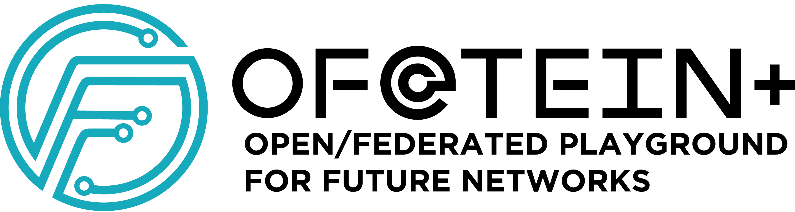

### Building and operating Open and Federated Future Internet (SDN/NFV/Cloud-integrated) Testbed
### A Project Sponsored by [Asi@Connect](http://www.tein.asia/main/?mc=0) (Grant No: Asi@Connect-17-094)

OF@TEIN+: Open/Federated Playground for Future Networks is proposed to further enhance, extend and expand [OF@TEIN](https://github.com/OFTEIN-NET/OFTEIN). The
main purpose of OF@TEIN+ is to build and operate an Open and Federated Future Internet (SDN/NFV/Cloud-integrated) Testbed in further promoting SDN-Cloud R&D collaboration among TEIN partners. 

## Primary goals of this project are:

1. Gather and Learn Together: Expanding the OF@TEIN Community and Sharing the Knowledge about
Open and Federated (i.e., shared) SDN/NFV/Cloud-integrated Playground amongst the Members.
2. Build and Upgrade Together: Deployment and Upgrade of Open/Federated Playground with
Distributed SmartX Box Playground Resources and Centralized Data Lake/Analytics Hardware.
3. Operate and Automate Together: Collaborate among Leading Members to enable Automated
DevOps-style Operation of Playground Resources and Platforms.
4. Play and Visualize Together: Collaborate with All Members in Experimenting (i.e., Playing) and
Visualizing “Plays over Playground”.
5. Investigate and Enrich Together: Investigate selected building-block topics on Future Network
technology and attempt to enhance the playground capability/agility by applying the investigation
outcomes.

## Co-PI (Corresponding): Dr Teck Chaw LING, tchaw@um.edu.my
Associate Professor, Faculty of Computer Science and Information Technology, 
University of Malaya, Malaysia. 
APAN Network Research Workshop Co-Chair. 
MYREN Network and Distributed WG Chair.  

## Co-PI: Dr JongWon Kim, jongwon@smartx.kr
Professor, School of Information & Communications, GIST, Gwangju, KOREA. 
APAN Technology Area Director (2014~) & APAN Cloud WG Co-Chair (2014~) 

## Project Members

Please go to [Member](Members/README.md) to see the list of participating collaborators for OF@TEIN+ Project.

## OF@TEIN+ Playground 

Please go to [Presentations](Presentations/Playground_Overview.pdf) to see the list of participating collaborators for OF@TEIN+ Project.

## Software Solutions

Please go to [Ops-Software](Playground-Ops-Software/README.md) to see the list of developed operational software solutions.
Please go to [Apps-Software](Playground-Apps-Software/README.md) to see the list of developed application software solutions.

## Project Meetings

Please go to [Meetings](Meetings/README.md) to see the list of previous project meetings.

## Project Presentations

Please go to [Presentations](Presentations/OFTEIN_Plus_Overview.pdf) to see the detailed project presentation.
